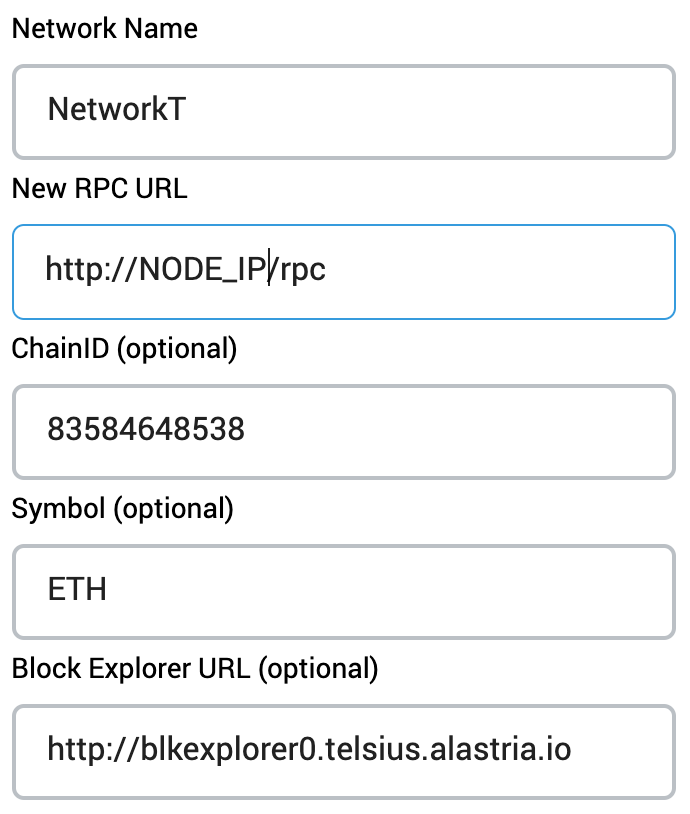

# Deploying a DApp Project to Alastria's Network T (Quorum)

This repository includes a complete Decentralized Application (DApp) as detailed in its [README](../README.md), which includes features like **Automated Testing**, **IPFS**, **ENS**, **Oracles**, **Contract Upgradeability**, **uPort** or an **Angular** frontend. 

It has been deployed to Network T (Quorum) as detailed next anc considering that there is an available Network T regular node, which can be deployed as indicated in 
https://medium.com/babel-go2chain/setting-in-motion-a-regular-node-in-the-telsius-network-of-alastria-c2d67b8369c7

## Configuring Alastria Access Point

The Network T regular node is exposed through a proxy available from `http://NODE_IP/rpc`. This proxy, 
the Alastria Access Point, filters incoming request to just the 
"eth", "net" and "web3" types. Moreover, it blocks all requests from sources not in its whitelist. 

It is possible to add an IP to the Alastria Access Point whitelist using the scripts available from 
the installation folder:

```bash
cd alastria-node/docker/general/alastria-access-point
./allow-ip.sh nginx 1.2.3.4
./reload-config.sh nginx
```

To check if the proxy is working properly, you can take a look at the nginx logs. 
First, get a shell inside the the container, where you can use `sudo docker container list -q` to get the CONTAINER_ID:

```bash
sudo docker exec -it CONTAINER_ID /bin/bash
```

Then, monitor the log of the access point nginx proxy to check if access is being granted: 

```bash
tail -f /var/log/nginx/access.log
```

## Contract Deployment

The recommended mechanism for contract deployment is using the HDWalletProvider so 
deployment transactions signing is done remotely.

Alternatively, transaction signing can be done locally in the node. This requires that the account 
from where the deployment is performed is unlocked during the process.

The deployment account is specified in `truffle.js`, together with the rest of the details
about the network, as follows:

```yaml
    networkt: {
      host: NODE_IP/rpc,
      port: 80,
      from: "0x123456789abcdef123456789abcdef123456789a",
      network_id: 83584648538,
      gasPrice: 0,
      gas: 4500000,
      type: "quorum"
    }
```

The account used as `from` should be then unlocked before the deployment is triggered.
To unlock the account temporarily, attach to the node from the machine where the node is running:

```bash
sudo docker exec -it CONTAINER_ID geth attach http://localhost:22000
```

Then, unlock the first account, for instance during 300 seconds (5 minutes):

```
personal.unlockAccount(personal.listAccounts[0], "password", 300)
```

> If there are no accounts in the target node, create one from the geth console using `personal.newAccount`

Then, it is possible to trigger the deployment of the contracts to the Network T:

```bash
npm run migrate -- networkt
```

### Testing Deployed Contracts

To test the contracts, once deployed, open the Truffle console on Network T:

```bash
truffle console --network networkt
```

And then, from inside the console, call one of the deployed contract methods, for instance:

```
truffle(networkt)> migrations = await Migrations.deployed()
truffle(networkt)> (await migrations.last_completed_migration()).toString()
```

## Configuring MetaMask

To interact with the deployed contracts from a browser, you can use the [MetaMask](https://metamask.io/)
extension. Once installed and configured, it is necessary to add Network T as one of the available networks 
to interact with contracts deployed there. 

To add Network T, click the currently selected network (usually `Main Ethereum Network`) and click
`Custom RPC` instead. Then, provide the details about the new network, at least:

* Network Name: Network T
* New RPC URL: http://NODE_IP/rpc
* ChainID: 83584648538

ChainID should be the same ID than the Network T ID, `83584648538`, to avoid issues with MetaMask implementation of EIP 155, which requires that both IDs are identical for security reasons. Additionally, a block explorer can be added to make it easier to explore transactions directly from links in MetaMask (though you will need to replace "tx" with "transaction" because the explorer uses a different URL template than MetaMask):

<p align="center">
  
</p>

Once the configuration is saved, the new network can be selected to interact with it. 
The **IP** from where the **browser** is interacting should be **in the Alastria Access Point whitelist**.
